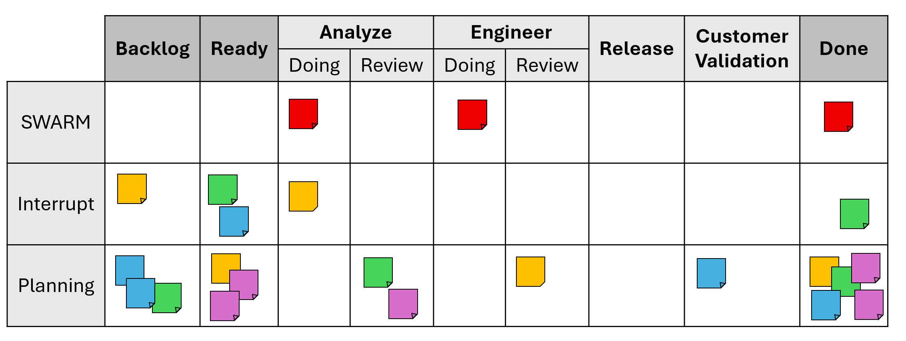

# Workflow & Board Anatomy

## Summary

The board (physical or digital) is the single shared model of current work. It makes flow,
bottlenecks, priorities, and collaboration needs obvious at a glance.

## Board Concept

Each ticket advances left to right through clearly defined stages (columns). Horizontal lanes
(rails) categorize urgency or work type. A healthy board lets any observer answer: What's most
urgent? What's blocked? Who needs help next?

## Board Diagram

## Columns

Columns reflect state changes in learning and validation, not just coding steps. Suggested baseline:

1. Backlog – Candidate items with potential value but not yet committed. Anyone can propose.
   Acceptance criteria not guaranteed complete.
2. Ready – Highest‑priority, well‑understood items with clear acceptance criteria and initial
   sizing. Pull from here when you start new work. Coach filles this column with tickets from the
   Backlog.
3. Analyze – Shepherd prepares or updates a lightweight design doc, confirms assumptions, and
   obtains 2 or more peer signoffs.
4. Engineer – Implementation and tests and instrumentation. Peer reviews (2 or more) required before
   moving forward.
5. Release – Code merges and deploys with feature flags or incremental rollout if applicable.
   Monitoring/observability is verified.
6. Customer Validation – Stakeholder / user confirms value delivered or provides immediate feedback
   loop.
7. Done – Definition of Done fully met and learnings captured for the retrospective.

### Column Exit Criteria

Before a ticket moves to the next column, it must pass a set of exit criteria.

- Backlog
    - Consensus that ticket represents most immediate business value
    - Acceptance criteria defined
- Ready
    - Has shepherd and start date
- Analyze
    - Design document written
    - Design document signed off by two people
- Engineer
    - All required tests pass
    - Code review signed off by two people
- Released
    - Passed Coach/PM acceptance review
    - Code checked in
    - Code integrated into solution without mocks
    - Code officially released to production
- Customer Validation
    - Customer validated as Done
    - New backlog items if needed
- Done
    - Relevant team learnings captured at retrospective

## Rails

Rails (aka swimlanes) categorize tickets by urgency or intent without mixing them visually.

- Swarm – Highest priority customer‑impacting issues. The team stops and collaborates. Target
  turnaround typically < 24 business hours.
- Interrupt – Unexpected but important asks (e.g., compliance request, executive demo). Limit active
  count (often 1) to protect focus.
- Planned – The steady value stream of intentionally prioritized work. Most capacity should live
  here.

Optional rails:

- Time Off – Visualize availability.
- Tracking – Items mostly waiting on external parties. Use retrospectives to reduce reliance on this
  lane because it can hide flow debt. Ideally all external dependencies are resolved before a ticket
  is moved to Ready.
- Lead / Manager – Long‑tail tasks owned by roles with fragmented time; isolates their slower
  cadence from standard WIP metrics.

## Flow Example

1. Backlog item is refined during planning; Coach moves it to Ready.
2. Engineer pulls it into Analyze, drafts design doc, gets two signoffs.
3. Moves to Engineer; implementation and tests and two PR reviews.
4. Deployed under Release; monitoring shows healthy.
5. Customer validates; feedback minor then Done.

## Backward Movement Policy

Tickets should almost never move left. When they do (e.g., from Release back to Engineer due to a
defect) the team records it and reviews the root cause in the next retrospective. It is treated as
an optimization signal, not blame.

## Navigation

[← Step 2: Principles](principles.md) | [Step 4: Roles & Responsibilities →](roles.md)
