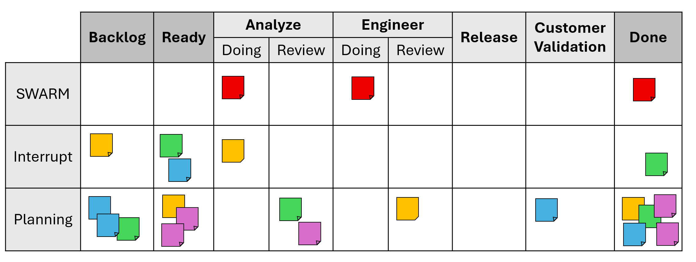

# Workflow and Board Anatomy

## Summary

The board is the shared model of current work. Whether it is physical or digital matters less than
whether the team actually trusts it. If the board is incomplete or out of date, the rest of the
process becomes harder to reason about.

Golazo uses the board to show state, priority, and collaboration needs in one place. A useful board
should make it possible for an observer to answer a few basic questions quickly: what matters most
right now, what is blocked, and where extra capacity would help.

## Board Concept

Tickets move from left to right through a small number of columns. Each column should represent a
meaningful change in state, usually in understanding, implementation, or validation. Horizontal
rails separate work by urgency or intent so that exceptional work does not disappear inside the
normal flow.

The board is not meant to capture every detail. It is meant to make the important details visible.

## Board Diagram

## Columns

The baseline column model below is intentionally simple. Teams may adjust names, but changes should
be made carefully because every extra state adds coordination cost.

1. Backlog: candidate work with potential value, not yet committed and not necessarily fully shaped.
2. Ready: the highest-priority work that is clear enough to start. The coach usually replenishes
   this column from the backlog.
3. Analyze: the shepherd prepares or updates the design doc, clarifies assumptions, and obtains peer
   signoff.
4. Engineer: implementation, tests, and instrumentation are completed and reviewed.
5. Release: the change is merged and deployed, with rollout and monitoring handled as needed.
6. Customer Validation: the stakeholder or user confirms that the intended value was actually
   delivered.
7. Done: the work is complete by the team definition of done and any relevant learning has been
   captured.

### Column Exit Criteria

Each column needs exit criteria. Without that, movement on the board becomes subjective and the data
becomes noisy.

- Backlog
    - the team agrees the item is worth keeping visible
    - acceptance criteria are defined well enough to support prioritization
- Ready
    - a shepherd is identified
    - the work is small enough and clear enough to start
- Analyze
    - the design document exists
    - at least two peers have signed off on the current approach
- Engineer
    - required tests pass
    - the code review has the required approvals
- Release
    - the change has passed the relevant acceptance checks
    - it has been integrated and released through the normal path
    - monitoring or observability checks are complete
- Customer Validation
    - the customer or stakeholder has validated the outcome, or follow-up work has been created
- Done
    - the ticket is actually closed and any important learning is available for retrospective review

Teams should expect some local variation, especially around release and validation, but the core
idea should remain stable: movement requires evidence, not optimism.

## Rails

Rails, also called swimlanes, separate work by urgency or type.

- Swarm: urgent customer-impacting issues that justify shared attention. Target turnaround is often
  under one business day.
- Interrupt: unexpected but important work that cannot wait for the normal queue, such as a
  compliance request or a time-sensitive demo ask.
- Planned: the normal stream of intentionally prioritized work.

Optional rails may also be useful:

- Time Off: used to make capacity changes explicit.
- Tracking: used for work mostly waiting on external parties. This can be useful, but it can also
  hide dependency debt if overused.
- Lead or Manager: used when certain role-specific tasks would otherwise distort normal WIP and flow
  expectations.

The complexity should not be underestimated. Extra rails are easy to add and hard to keep useful.

## Flow Example

1. A backlog item is refined during planning and moved into Ready.
2. An engineer pulls it into Analyze, drafts the design document, and gets peer signoff.
3. The ticket moves into Engineer for implementation, testing, and review.
4. The change is released and monitored.
5. The customer or stakeholder validates the result, and the ticket moves to Done.

This is the happy path. Real work is often messier. The point of the model is not to deny that, but
to make deviations visible.

## Backward Movement Policy

Tickets should rarely move backward.

When backward movement does happen, the team should record it and review the cause in the next
retrospective. Moving from Release back to Engineer, for example, is usually a sign that something
earlier in the process did not hold. That is useful information. It should be treated as an input to
process improvement, not as a blame event.

## Navigation

[← Step 2: Principles](principles.md) | [Step 4: Roles & Responsibilities →](roles.md)
