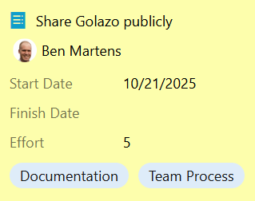

# Tickets and Sizing

## Summary

A ticket is the smallest independently valuable slice of work that a single person can shepherd from
idea to validated outcome within the team’s SLA (commonly < 2 weeks). Every ticket must produce
demonstrable business or user value.

## Ticket Definition

Each ticket represents a cohesive change that, when complete, can be reviewed, released, and
validated. It includes clear acceptance criteria and a definition of done covering quality signals
(tests, monitoring, docs) so the team can support it afterward.

## Core Fields

| Field               | Purpose                                                     | Notes                                             |
| ------------------- | ----------------------------------------------------------- | ------------------------------------------------- |
| Title               | Crisp outcome phrased as value ("Enable X so Y")            | Avoid vague verbs ("improve", "handle stuff")     |
| Shepherd            | Primary facilitator ensuring flow and quality               | Not required to do all implementation             |
| Acceptance Criteria | Observable conditions proving value delivered               | Written before significant engineering starts     |
| Cost Estimate       | Effort assuming focused work (e.g., ideal days / Fibonacci) | Used to spot outliers, not to micromanage         |
| Start / End Dates   | Actual flow timing for metrics and retros                   | Set explicitly when leaving Ready / entering Done |
| Tags / Color        | Group by workstream/domain                                  | Avoid over‑tagging; see notes below               |

## Example

## Colors

Teams should establish 5-10 primary workstreams and assign each a distinct color for related
tickets. This visual system creates clarity and balance across the team's efforts.

- Progress Visibility: At a glance, team members and stakeholders can see which workstreams are
  actively moving forward and which may be stalled or underrepresented.
- Balanced Work Distribution: Color coding naturally encourages team members to pull tickets across
  different workstreams rather than clustering in a single area, promoting knowledge sharing and
  reducing bottlenecks.
- Retrospective Insights: Color patterns reveal whether the team is over-indexing on certain types
  of work (e.g., all technical debt, no new features) and guide rebalancing discussions.

## Ticket Readiness

All must be true:

- Delivers standalone value. Stakeholder can validate it in isolation.
- Fits within 2 week SLA.
- Acceptance criteria and DoD can be unambiguously verified.
- Minimal design complexity. Excess ambiguity means consider spike.

If any item fails, break the ticket down _before_ starting.

## Spike Tickets

Use a "Spike" ticket when uncertainty prevents meaningful acceptance criteria (e.g., unfamiliar API,
unclear algorithm feasibility). Characteristics:

- Goal: answer specific, enumerated questions.
- Output: documented findings and follow‑on concrete tickets.
- Time‑boxed: small (often 2 to 3 days or less). If answers expand scope, create a new spike rather
  than sprawling.
- Closure: team reviews answers; confirms next steps.

Scope spikes tightly. "Research database options" is weak, but "Compare 3 time‑series storage
options across ingest cost, retention, query latency; recommend one" is actionable.

## Anti‑Patterns

- Tickets as mini‑projects spanning multiple weeks.
- Vague titles ("Clean up code", "Handle edge cases").
- Doing work not on the board.
- Large refactors without articulated value (performance, reliability, clarity).
- Spikes that implement code instead of answering questions.

## Healthy Behaviors

- Split early when you detect dual outcomes emerging.
- Pair frequently on risky or novel tickets for faster learning and fewer surprises.
- Reference prior design docs for similar areas to maintain consistency.

## Ownership Model

Golazo optimizes for _team_ ownership. Any engineer can pick any Ready ticket. The Shepherd listed
on the ticket is the facilitator ensuring:

- Design doc prepared and signed off.
- Reviews happen promptly.
- Definition of Done fully met (tests, monitoring, docs).
- Customer validation step closes the loop.

"Shepherd" does not mean "solo implementer". Pairing and micro‑swarming encouraged. Knowledge
rotates naturally as interests vary and coaches watch for area monopolies.

## Growth and Equity

The use of short, clearly defined tickets creates equitable access to impactful work:

- Rotating on call engineer and open ticket selection prevents gatekeeping.
- Junior engineers gain confidence through design doc signoffs with shared responsibility, not
  isolation.
- Senior engineers demonstrate leadership by refining backlog items, mentoring during Analyze,
  enforcing quality fundamentals, and shaping architectural consistency.
- Career progression discussions map leadership expectations (technical depth, cross‑team influence)
  to Golazo artifacts (design docs authored, cross‑area pairing, backlog curation).

## Navigation

[← Step 4: Roles & Responsibilities](roles.md) | [Step 6: Design Docs →](design-docs.md)
