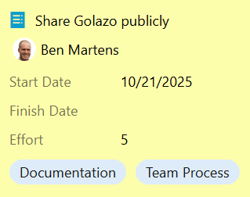

# Tickets and Sizing

## Summary

In Golazo, a ticket is the smallest unit of work that can produce a meaningful outcome and move
through the full system, from shaping to validation, within the team service-level expectation. On
many teams that means less than two weeks, and often much less.

The size constraint matters because most of the other practices depend on it. Reviews are easier,
planning is more adaptable, and customer feedback is cheaper when the unit of work is small.

## Ticket Definition

A ticket should represent one coherent change that can be reviewed, released, and validated without
depending on a large unresolved bundle of adjacent work. It should also include acceptance criteria
and a definition of done that covers quality expectations such as tests, monitoring, and relevant
documentation.

If the work cannot be described that way, it is probably not a ticket yet. It may be a larger body
of work that still needs to be split.

## Core Fields

| Field               | Purpose                                             | Notes                                           |
| ------------------- | --------------------------------------------------- | ----------------------------------------------- |
| Title               | States the outcome in concrete terms                | Avoid vague verbs and generic cleanup language  |
| Shepherd            | Owns the flow of the ticket through the system      | Does not need to do all implementation          |
| Acceptance Criteria | Defines what success looks like                     | Should exist before major implementation starts |
| Cost Estimate       | Gives a relative or focused-effort size signal      | Useful for spotting outliers, not for control   |
| Start / End Dates   | Records actual timing for review and retrospective  | Helps with cycle-time analysis                  |
| Tags / Color        | Associates the ticket with a workstream or category | Keep this simple enough to stay readable        |

## Example

## Colors

Many teams benefit from assigning a small set of colors to major workstreams. The value is mostly
visual.

- It helps the team see whether work is concentrated in one area or spread more evenly.
- It makes it easier to notice when an important workstream has stopped moving.
- It gives retrospectives another lightweight signal about how time was actually spent.

The system should stay simple. Too many categories reduce the benefit.

## Ticket Readiness

Before work starts, all of the following should be true:

- the ticket delivers a standalone outcome that someone can validate
- it fits within the team SLA
- the acceptance criteria and definition of done are concrete enough to verify
- the design complexity is understood well enough that the work is not mostly discovery

If one of these is missing, split the ticket or create a spike first.

## Spike Tickets

Use a spike when uncertainty is high enough that normal acceptance criteria would be mostly
guesswork. That might mean an unfamiliar API, an unresolved technical constraint, or an unclear
feasibility question.

Characteristics of a good spike:

- it answers a specific set of questions
- it produces documented findings and follow-up tickets
- it is time-boxed, usually to a few days or less
- it ends with a decision or a clearer next step

The goal is not to hide implementation work inside research. A spike should reduce uncertainty. If
it starts becoming a delivery ticket, split it.

## Anti‑Patterns

- Tickets that are really small projects
- Titles such as "clean up code" or "handle edge cases"
- Work happening off the board
- Broad refactors without a stated reason or measurable benefit
- Spikes that quietly turn into implementation

## Healthy Behaviors

- Split work early when two distinct outcomes begin to emerge
- Pair on risky or unfamiliar tickets to reduce rework later
- Reuse earlier design docs when they provide relevant precedent

## Ownership Model

Golazo is built around team ownership rather than fixed personal territory. Any engineer can pull a
ticket from Ready.

The shepherd is responsible for keeping the ticket moving and making sure critical steps happen:

- the design doc exists when needed and receives signoff
- reviews happen in time to keep the ticket flowing
- the definition of done is actually met
- customer validation closes the loop

That does not imply solo execution. Pairing and short swarms are expected when they improve flow or
reduce risk.

## Growth and Equity

Short, well-formed tickets can support more equitable access to meaningful work.

- Open ticket selection reduces gatekeeping
- Junior engineers can contribute in new areas with clearer support structures
- Senior engineers can demonstrate leadership through shaping, review, and architectural guidance
- Career conversations can point to concrete artifacts such as authored design docs, cross-area
  pairing, and backlog refinement

This is one of the more important cultural side effects of the model. It is also one of the easier
ones to lose if the team quietly reintroduces strong ownership silos.

## Navigation

[← Step 4: Roles & Responsibilities](roles.md) | [Step 6: Design Docs →](design-docs.md)
